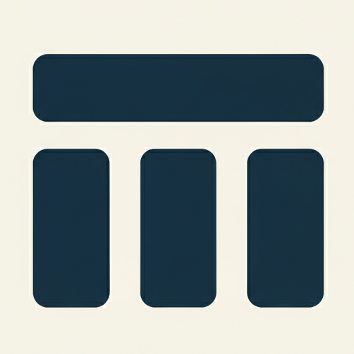
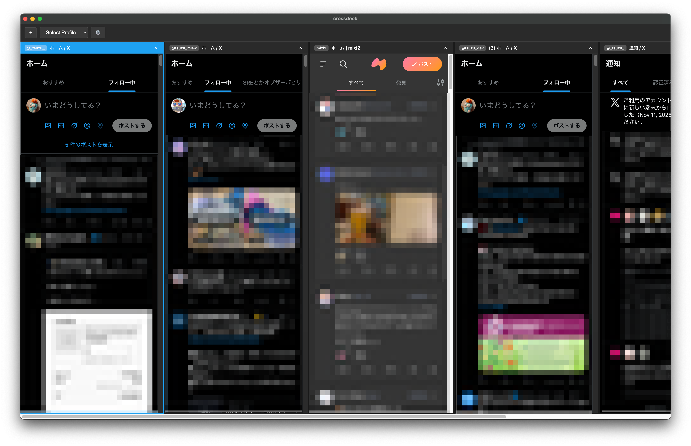

# Crossdeck 

Old Tweetdeck Alternative



## Features

- **Multiple Profiles**: Create, rename, and manage multiple profiles, each with separate login sessions
- **Horizontal Scrolling Layout**: View all tabs simultaneously in a horizontal scrolling layout with minimum 400px width per tab
- **Profile-Based Tabs**: Each tab can use a different profile/account
- **Keyboard Shortcuts**: Switch between tabs instantly with Cmd/Ctrl+1-9 (works even when webview is focused)
- **Drag & Drop Reordering**: Reorder tabs by dragging tab headers
- **Session Persistence**: Tabs and their URLs are automatically saved and restored on restart
- **Clean Interface**: Dark-themed, distraction-free browsing experience with X/Twitter header automatically hidden
- **Profile Management**: Create, rename, and delete profiles through the settings modal

## Limitations

- **WebAuthn/Passkeys**: Not supported due to Electron sandboxing limitations. Use traditional password authentication instead.

## Installation

```bash
npm install
```

## Usage

### Development Mode
```bash
npm run dev
```

### Build and Run
```bash
npm start
```

### Build Distributable App

To create distributable applications for macOS, Linux, and Windows:

```bash
# Create distribution packages (DMG, AppImage, NSIS installer)
npm run dist

# Or just create an unpacked app in release folder for testing
npm run pack
```

The built apps will be in the `release/` folder:
- **macOS**: crossdeck-0.0.1-universal.dmg and crossdeck-0.0.1-universal-mac.zip (works on both Intel and Apple Silicon)
- **Linux**: crossdeck-0.0.1.AppImage
- **Windows**: crossdeck Setup 0.0.1.exe

## How to Use

### Keyboard Shortcuts

- **Cmd/Ctrl + 1-9**: Switch to the corresponding tab (1 = leftmost tab, 2 = second from left, etc.)
  - These shortcuts work even when a webview has focus
  - If the tab is off-screen, it will automatically scroll into view
